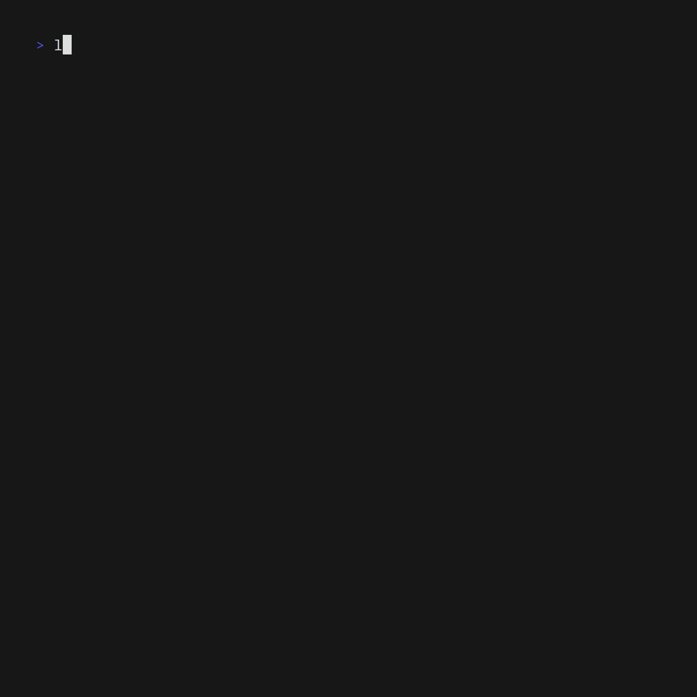

![Badge Build] 
![Badge Version]
![Badge License]
![Badge Language] 


## Introduction
Lexido is an innovative assistant for the Linux command line, designed to boost your productivity and efficiency. Powered by Gemini Pro 1.0 and utilizing the free API, Lexido offers smart suggestions for commands based on your prompts and importantly **your current environment**. Whether you're installing software, managing files, or configuring system settings, Lexido streamlines the process, making it faster and more intuitive.

## Examples
<p align="center">
  
  
</p>


## Features
- **Command Suggestions**: Simply type `lexido [prompt]` to get actionable command suggestions.
- **Cross-Platform**: Support for both Linux and macOS
- **Continued Conversations**: Use `lexido -c [prompt]` to continue a previous conversation, allowing for context-aware suggestions.
- **Piping Support**: Pipe commands into Lexido (e.g., `ls | lexido [prompt]`) for enhanced command list suggestions.
- **Efficiency**: Designed with efficiency in mind, Lexido helps you get things done NOW.

## Installation

### For Arch Linux:
Lexido is available on the AUR. Install it using the package manager of your choice such as:
```bash
yay -S lexido
```
### For others and macOS:
Head to the [releases](https://github.com/micr0-dev/lexido/releases) tab to pick up a binary!
Once downloaded, you'll want to make Lexido easily accessible from anywhere on your computer. Here's how:

1. **Rename the downloaded file:**

   The downloaded file might have a long and specific name, like "v1.0-lexido-linux-amd64". For easier use, consider renaming it to just "lexido". 

2. **Make the file executable:**

   Open your terminal and navigate to the folder where you downloaded the Lexido binary. Then, run the following command to make the file executable:

   ```bash
   chmod +x ./lexido
   ```

3. **Move the file to your system's path:**

   **Why do this?** By placing the renamed and executable Lexido file in your system's path, you can run it from any terminal window without needing to specify the full path to the file. It's a shortcut for convenience!

   Here's an example command assuming you downloaded Lexido to your Downloads folder:

   ```bash
   mv ~/Downloads/lexido /usr/local/bin/lexido
   ```

Currently, lexido is not on any package managers but if you would like that to change please contribute!

### Compile from source
Ensure you have Go installed on your system. Follow these steps to install Lexido:

1. Clone the Lexido repository:
```bash
git clone https://github.com/micr0-dev/lexido.git
```

2. Navigate to the Lexido directory:
```bash
cd lexido
```

3. Build the project:
```bash
go build
```

4. Optionally, move the Lexido binary to a location in your PATH for easy access.

## Usage
- To get command suggestions:
```bash
lexido "install teamspeak via docker"
```

- To continue with a previous prompt:
```bash
lexido -c "add more details or follow-up"
```

- To use with piping commands:
```bash
ls | lexido "what should I do with these files?"
```

## FAQ

### Why is the binary so big?
The binary's size mainly consists of the built-in networking and encryption libraries of Go. 
A quick inspection showcases this:
```bash
> goweight
   12 MB runtime
  8.1 MB net/http
  5.3 MB google.golang.org/protobuf/internal/impl
  4.1 MB net
  4.1 MB golang.org/x/net/http2
  3.9 MB golang.org/x/sys/unix
  3.7 MB crypto/tls
  3.3 MB google.golang.org/grpc
```
### How does it know what system I am running?
Before requesting the LLM the program does what is known as prompt building or contextualization, it collects different data about your system and your current scenario to help the LLM more accurately answer. Giving the LLM context about your situation allows it to better understand what you are asking or how to reply.

If you have any more questions feel free to reach out and ask

## Contributing
Contributions are what make the open-source community such an amazing place to learn, inspire, and create. Any contributions you make are **greatly appreciated**.

1. Fork the Project
2. Create your Feature Branch (`git checkout -b feature/AmazingFeature`)
3. Commit your Changes (`git commit -m 'Add some AmazingFeature'`)
4. Push to the Branch (`git push origin feature/AmazingFeature`)
5. Open a Pull Request

## License
Distributed under the GNU Affero General Public License v3.0. See `LICENSE` for more information.

## Acknowledgements
- [Gemini Pro 1.0](https://deepmind.google/technologies/gemini/) for the LLM powering Lexido.

Made with 💚 by Micr0byte

<!----------------------------------{ Badges }--------------------------------->

[Badge Build]: https://github.com/micr0-dev/lexido/actions/workflows/goBuild.yml/badge.svg
[Badge Issues]: https://img.shields.io/github/issues/micr0-dev/lexido
[Badge Pull Requests]: https://img.shields.io/github/issues-pr/micr0-dev/lexido
[Badge Language]: https://img.shields.io/github/languages/top/micr0-dev/lexido
[Badge License]: https://img.shields.io/github/license/micr0-dev/lexido
[Badge Version]: https://img.shields.io/github/v/release/micr0-dev/lexido
